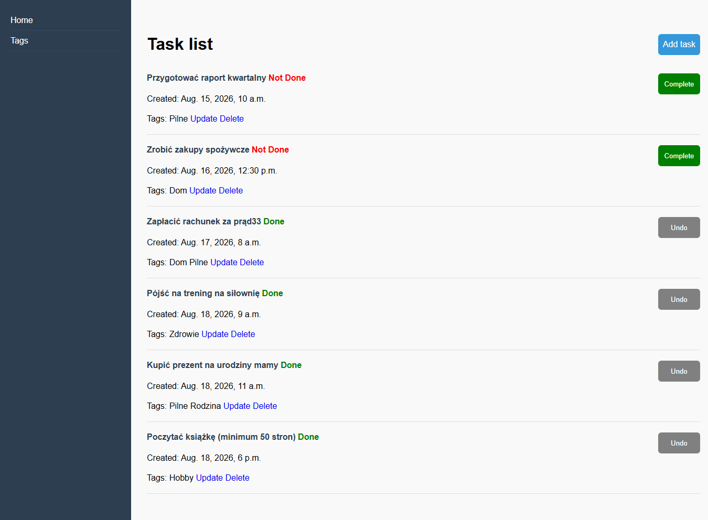
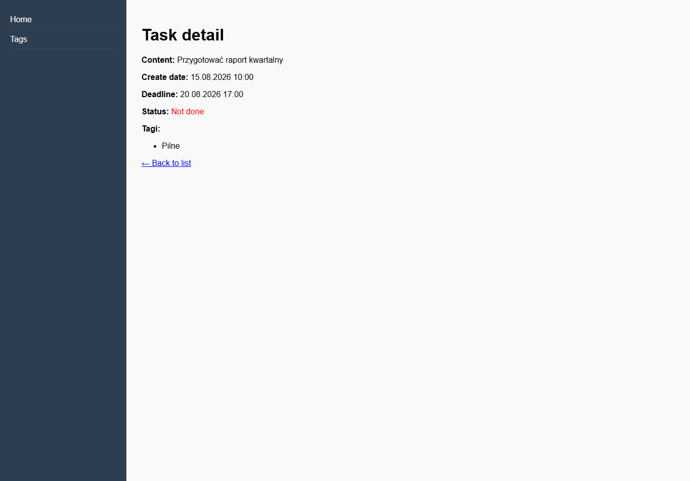
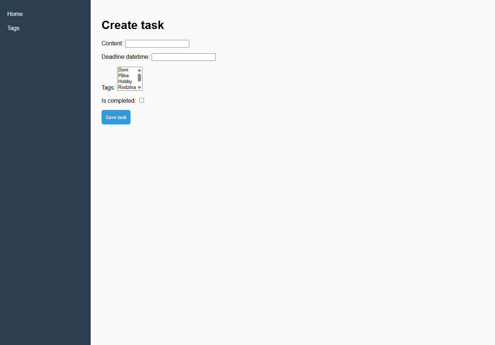
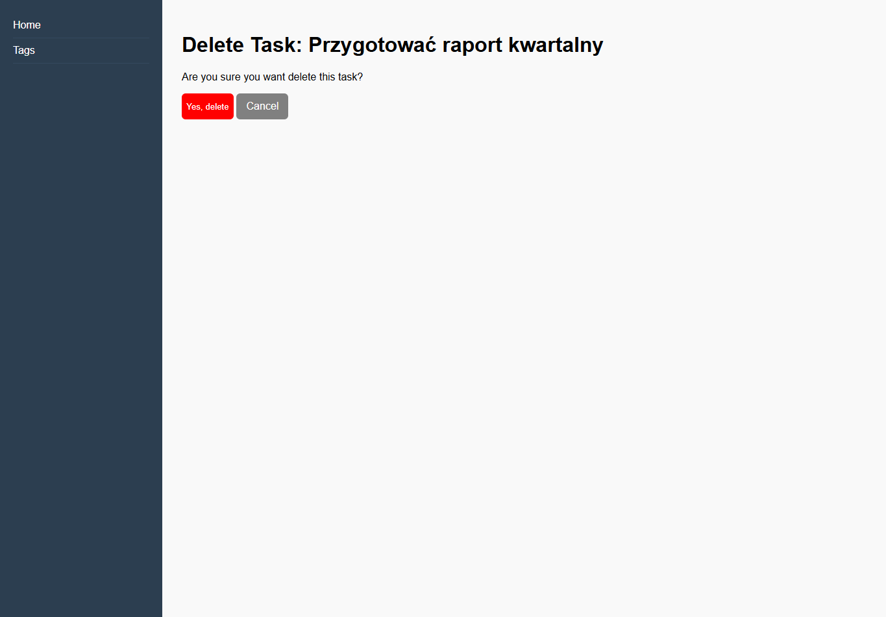
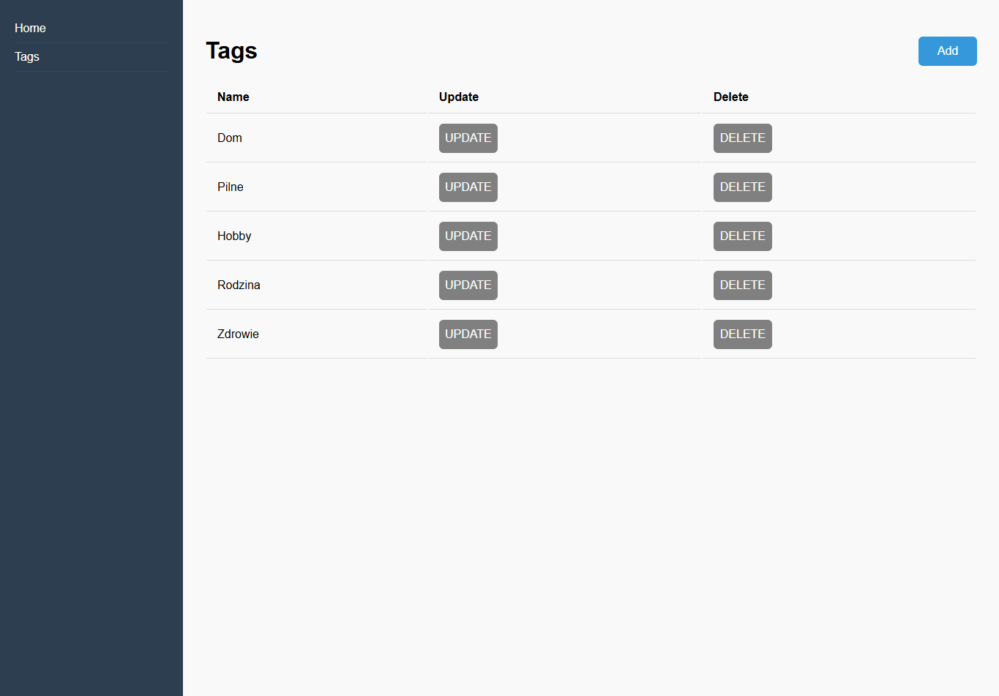

#  Django To-Do App

A simple, intuitive, and fully tested web application for managing tasks and tags, built with the Django framework.

## Features

* **Task Management (CRUD):** Create, read, update, and delete tasks.
* **Tag System:** Create custom tags and assign them to tasks (Many-to-Many relationship).
* **Quick Actions:** Instantly toggle task status (DONE / NOT DONE) with a single click.
* **Data Validation:** Built-in form safeguards to prevent empty or invalid data submission.
* **Comprehensive Testing:** The application is fully covered with unit tests (testing both models and views).

## Technologies

* **Backend:** Python 3, Django 6+
* **Database:** SQLite (default)
* **Frontend:** Django Templates (HTML/CSS)
* **Code Quality & Testing:** djLint (HTML formatting), built-in Django `unittest` framework and flake8 (py formatting)

## Screenshots








##  Local Setup

Step-by-step instructions on how to run the application on your local machine (Windows guide).

### 1. Clone the repository
Clone the project to your local machine and navigate to the project directory:
```bash
git clone https://github.com/kacper7-7/to-do-list.git
cd to-do-list
```

### 2. Create and activate a virtual environment

```bash
python -m venv .venv
.venv\Scripts\activate
```

### 3. Install dependencies

```bash
pip install -r requirements.txt
```

### 4. Apply database migrations

```bash
python manage.py migrate
```

### 5. Load fixtures data

```bash
python manage.py loaddata fixtures/tasks_data
```

### 6. Run the development server

```bash
python manage.py runserver
```
The application will be available in your browser at: http://127.0.0.1:8000/


## Running Tests

The application is fully tested. To verify that everything is working correctly, run the following command in your terminal:

```bash
python manage.py test
```